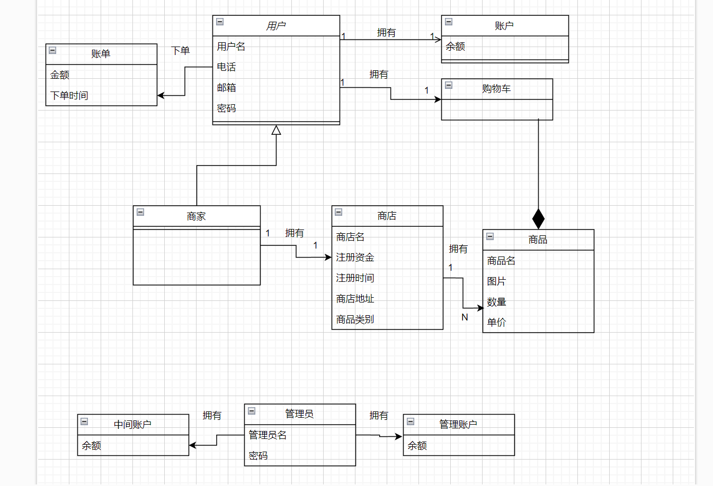
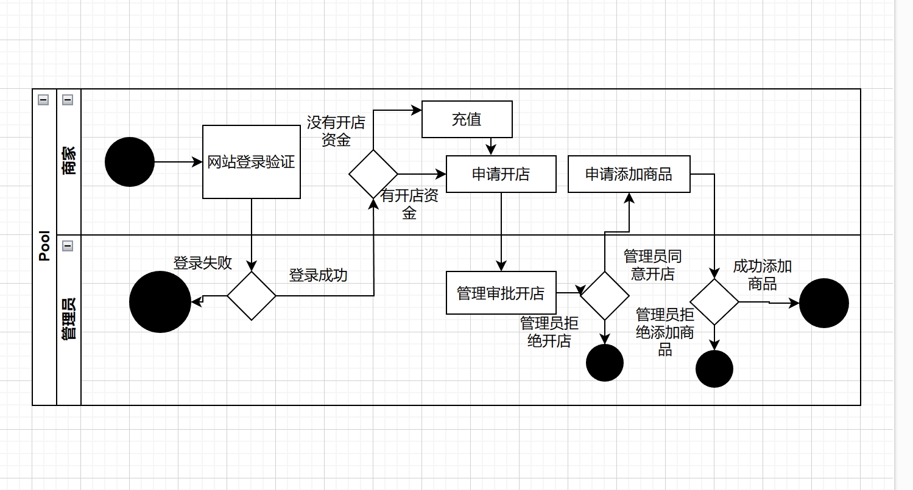
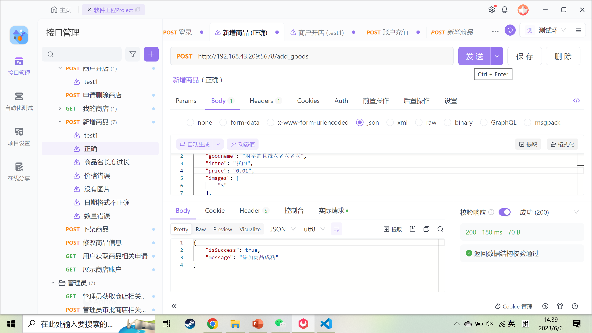
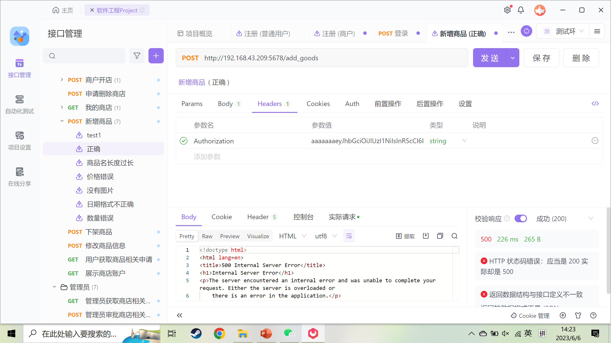
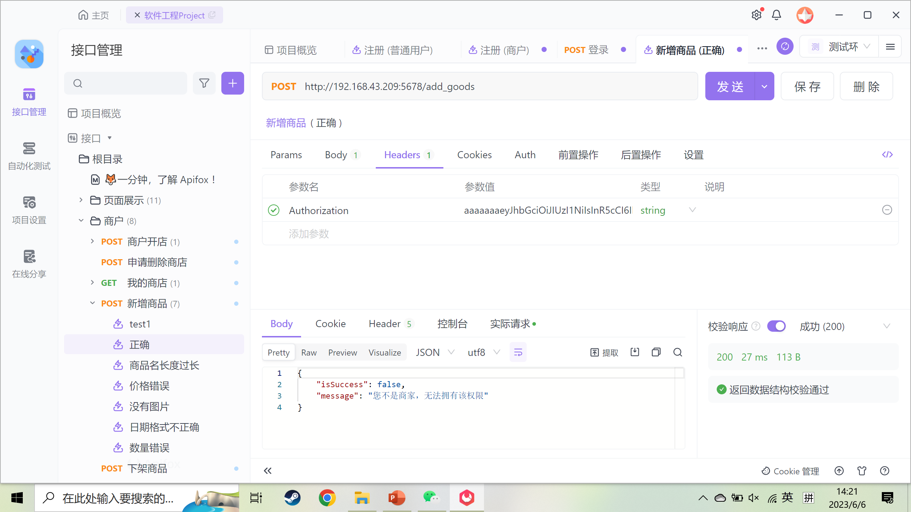
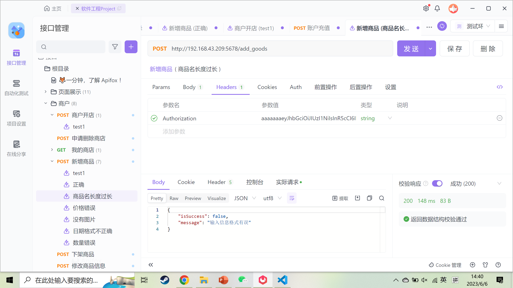
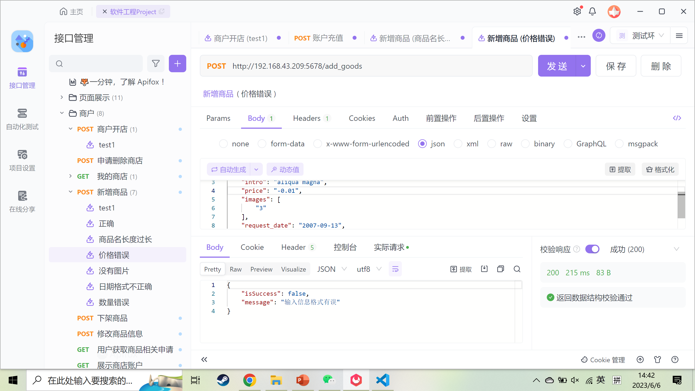
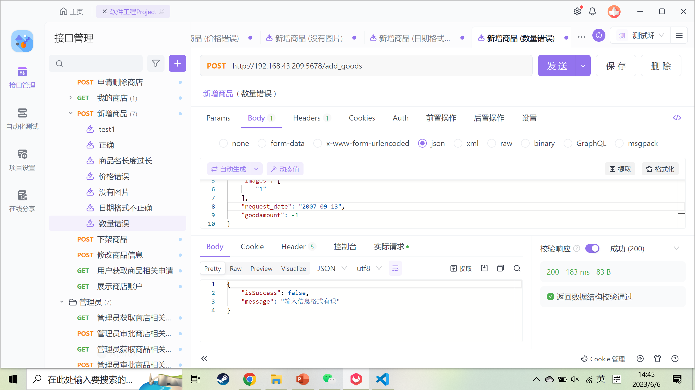
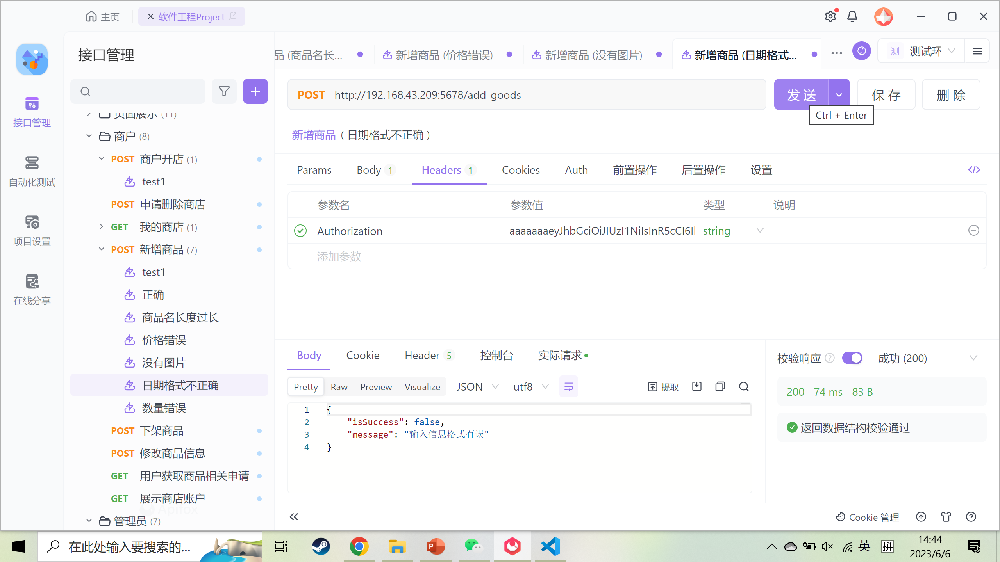

# 前端分工

## 陈实立：

## 柏露：

### 订单界面

- 可以按照订单类型来查看对应的订单，点击查看订单按钮查看订单具体的信息

- 在具体的订单界面中可以支付订单和撤销订单

# 实验设计

## 订单界面

订单界面通过一个下拉框来选择查看的订单的类型，然后通过vue的v-for和v-if来展示指定类型的订单列表。查看订单按钮会将订单号传递给具体订单的页面，在具体订单的页面会通过订单号来得到该订单号具体的信息，然后通过列表展示出来。

# 遇到问题及解决方案

1. 在具体的订单页面拿到的订单号不能使用

在最开始的js代码中将订单号用let来赋值一个变量，然后将该变量作为api参数来得到订单信息，但是这样并不能将订单号传给api。最后通过定义一个函数，在函数里拿到订单号，再在函数里调用api解决里该问题。

```js
function getOrderReq() {
    let order_id = route.query.keyword
    console.log(order_id)
    get_order_by_id({order_id:order_id}).then(data => {
    console.log(data)
    goodList.value = data.result.goods
    order_status.value = data.result.status
    total_price.value = data.result.total
}).catch(() => {
    Message({ type: 'error', text: '请求异常'});
  })
}

getOrderReq()

```

# 分析类图



# 添加商品泳道图



上面的是添加商品的泳道图，商家要先登录，让后充值注册资金，在使用注册资金开店，在管理员通过开店申请后，商家就可以申请添加商品，如果管理员通过添加商品申请，则成功添加商品。

# 添加商品黑盒测试

添加商品的api有商品名，价格，数量，日期以及token等参数。商品名的等价类有合规的商品名和过长的商品名，价格和数量的等价类有大于等于0的价格，数量以及小于0的价格，数量，日期的等价类有符合格式的日期和不符合格式的日期。token的等价类有普通用户，未开店的商户以及开了店的商户。为了覆盖等价类有下面的测试，同时为了兼顾边界值分析，正常的测试的参数都在边界处，错误的测试错误的参数都在边界外一点。

1. 开了店的商户，参数都正常的测试,结果应该正确



2. 未开店的商户，参数都正常的测试,结果应该错误



3. 普通用户，参数都正常的测试,结果应该错误



4. 开了店的商户，商品名过长的测试,结果应该错误



5. 开了店的商户，价格错误的测试,结果应该错误



6. 开了店的商户，数量错误的测试,结果应该错误



7. 开了店的商户，日期错误的测试,结果应该错误



# 心得体会

第三次实验新增加的功能比较少，前端实现起来也比较简单，所以遇到的问题不多，实现代码也比较快。这次实验主要的收获在于学会了分析类图和泳道图的绘画和作用，也自己设计并进行了黑盒测试，了解了黑盒测试的作用。通过使用这些在课上学习的uml图和测试，让我更好的理解了软件设计和软件测试。