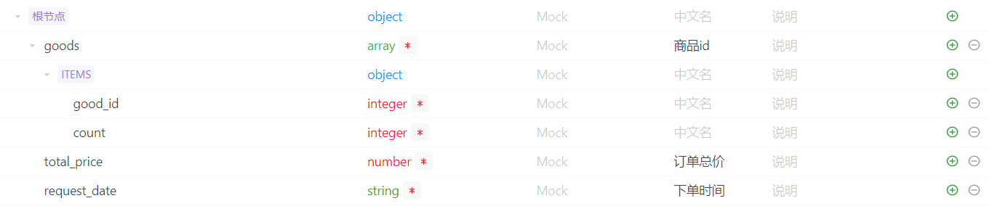
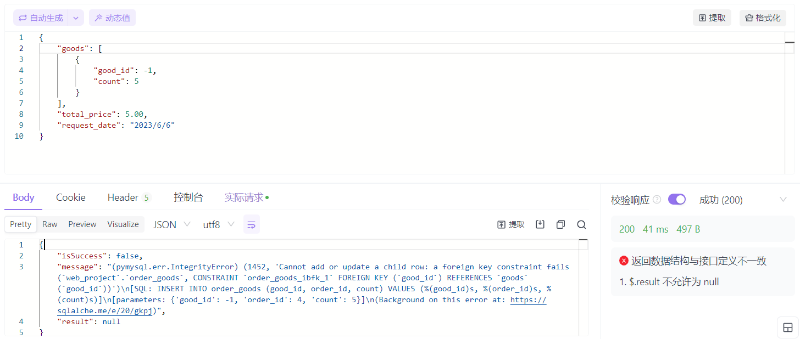
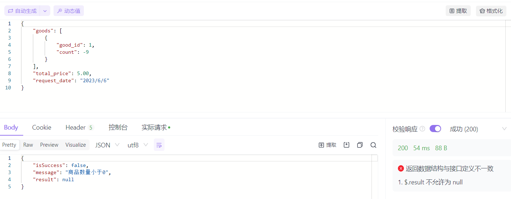
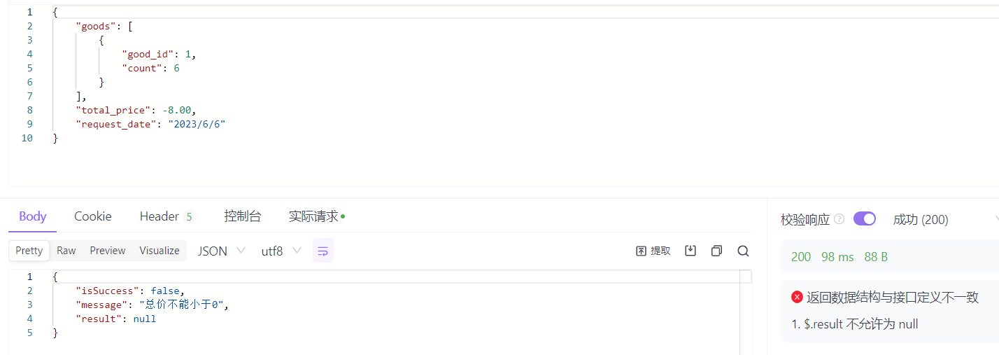
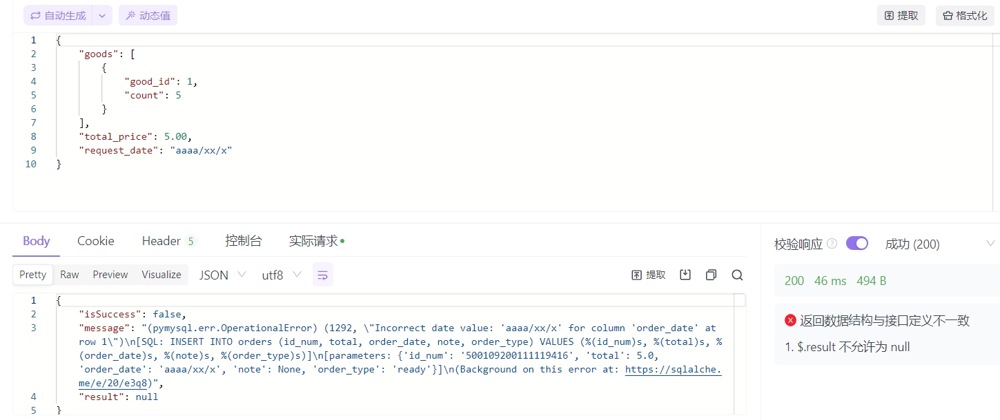

# 前端分工

## 陈实立：

### 立即购买（功能添加）

- 在商品界面增加立即购买的功能

### 购物车购买

- 在购物车界面实现下单购买的功能

### 下单界面

- 展示订单所必须的信息
- 有提交订单按钮

### 支付订单

- 展示订单金额
- 等待用户支付  

### 支付成功

- 显示支付成功的结果

# 代码检查结果


# 遇到问题及解决方案

陈实立遇到了一些设计和语言细节方面的问题：

1. 我们的设计为：从购物车或商品界面跳到下单界面时并不会向后端发送请求，那么应该如何保存订单中的商品呢？

> 我选择区别对待这两种下单方式：从购物车下单时，我们可以将下单的商品暂存在购物车中（购物车中选中的商品即为订单中的商品）；从商品页面直接下单时，由于只有一个商品，我选择通过路由传参的方式将商品放在路由中。

2. JS 发 post 请求失败（无法发出请求，在浏览器中看不到这个请求）

> 经过仔细排查，发现，这是由于我在 post 的参数中混入了一个响应式对象，导致请求无法发送。

3. JS 如何判断对象为空

> 如果 a={}，直接 if(a) 的话是会执行 if 对应的代码的，正确的判断方式如下：
>
> ```js
> function isEmpty(obj) {
>     return Object.keys(obj).length === 0;
>   }
> ```


# 软件需求分析

## 项目背景

当今社会已经进⼊了互联网时代，网络购物作为⼀种新型的经济交易和流通手段，以互联网信息平台为支撑，集合了信息流、商流、资金流、物流为⼀体促进整个贸易活动的线上进行。在线购物简化了交易的流程，让消费者享受⾜不出户就可以浏览并对⽐多种商品信息，买到⾃⼰⼼仪商品的便利。同时，在线购物开放并多元的售卖⽅式，为市场经济带来了⽆限活⼒。因此，本项⽬以⽹购经济为背景，开发⼀个在线购物Web，实现多种⽤户的需求，为⽤户提供买卖平台。

## 系统的总体介绍

1. 系统中⼀共有三⼤类⻆⾊，分别是系统管理员、商户和普通⽤户。
2. 系统管理员负责对整个购物⽹站信息进⾏整体的把控，如批准商户开店申请、批准商户上架商品申请、管理⽤户及商户信息、管理促销活动等。

3. 商户能够对⾃⼰商家的商品进⾏操作，如商品查询、商品信息修改、上架或下架商品、发货、定制
    促销活动等。同时，商户也可以随时对⾃⼰的个⼈信息进⾏修改，如地址、联系⽅式、密码等。
4. 普通⽤户可以在系统中购买商品、确认收货、查询订单、订阅店铺等。同时，与商户⼀样，也可随
    时对⾃⼰的个⼈信息进⾏修改，如⼿机号、邮箱、密码等。
5. 系统管理员有⼀个系统预设的账号，并且不可通过其他途径创建管理员账号。

## 系统整体⽤例图


## 用户下单泳道图


# 软件测试


## 提交订单接口黑盒测试

该接口的输入，输出数据格式如下：

输入：



输出：


该接口中各数据需要满足的条件如下：

good_id（商品 id）：大于 0 的整数

count（商品数量）：大于 0 的整数

total_price（商品总价）：大于等于 0 的浮点数，等于所有商品的单价*数目的和

request_data（下单日期）：格式为 2023/6/5


| 输入数据     | 有效等价类                | 无效等价类                             |
| ------------ | ------------------------- | -------------------------------------- |
| good_id      | （1）大于 0 的整数        | （2）小于等于 0 的整数                 |
| count        | （3）大于 0 的整数        | （4）小于等于 0 的整数                 |
| total_price  | （5）大于等于  0 的浮点数 | （6）小于 0 的浮点数                   |
| request_data | （8）符合格式的输入       | （10）将年月日位置的数字换为非数字字符 |


测试中，good_id = 1 时，商品单价为 1 元

| 输入数据                                                     | 预期输出                                                     | 覆盖的等价类          |
| ------------------------------------------------------------ | ------------------------------------------------------------ | --------------------- |
| good_id=1<br />count=5<br />total_price=5.00<br />request_data=2023/6/6 | isSuccess=true <br />message=“下单成功” <br />返回合法的order_id | （1）（3）（5）（8）  |
| good_id=-1<br />count=5<br />total_price=5.00<br />request_data=2023/6/6 | isSuccess=false <br />message=“商品 id 有误” <br />order_id=-1 | （2）（3）（5）（8）  |
| good_id=1<br />count=-9<br />total_price=5.00<br />request_data=2023/6/6 | isSuccess=false <br />message=“商品数目需要大于0” <br />order_id=-1 | （1）（4）（5）（8）  |
| good_id=1<br />count=6<br />total_price=-8.00<br />request_data=2023/6/6 | isSuccess=false <br />message=“商品总价非法” <br />order_id=-1 | （1）（3）（6）（8）  |
| good_id=1<br />count=5<br />total_price=5.00<br />request_data=aaaa/xx/x | isSuccess=false<br />message=“下单日期非法” <br />order_id=-1 | （1）（3）（5）（10） |


以上各测试结果如下：


### （1）（3）（5）（8）


### （2）（3）（5）（8）




### （1）（4）（5）（8）




### （1）（3）（6）（8）




### （1）（3）（5）（10）




# 心得体会

第三次实验新增加的功能比较少，但是下单部分的实现还是有一定的难度，我在写代码的时候也遇到了一些小 bug，不过总体上来说，前端的实现还是较为顺利的。

当然，这次实验最大的收获并不在于代码，我在这次实验中于练习了系统用例图和泳道图的绘制，也感受到它们强大的表达能力；并且使用等价类划分的方法设计并进行了黑盒测试，进一步提高了代码的可靠性。

最后，我想感谢助教（助教每次发的实验文档都十分详细，实验准备也非常认真），也感谢我们的沈老师（从软件的设计，到编码，再到测试，沈老师的课对于实践是很有启发的）😘（完结撒花🌹）

